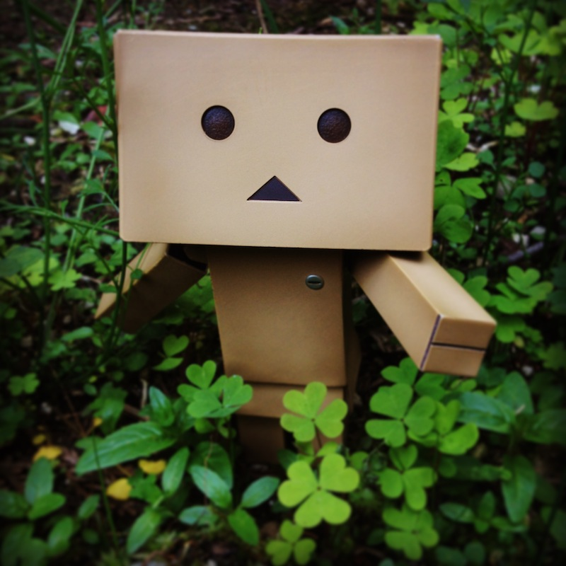

========================================
Danboard
========================================

What's Danboard ?
========================================

`image source <https://www.flickr.com/photos/meaganmakes/14189116565/>`_

license

.. image:: img/cc-by-nc.png
    :alt: CC BY-NC

What's this project doing ?
========================================

**make Danbo keep watching you :P**

we use Raspberry Pi 2 + Raspberry Pi Camera Module + ULN2003 Stepper Motor

use camera to get image of current scene, then detect the faces, control stepper to turn Danbo's face

License
========================================

`GPL v3 <LICENSE>`_
